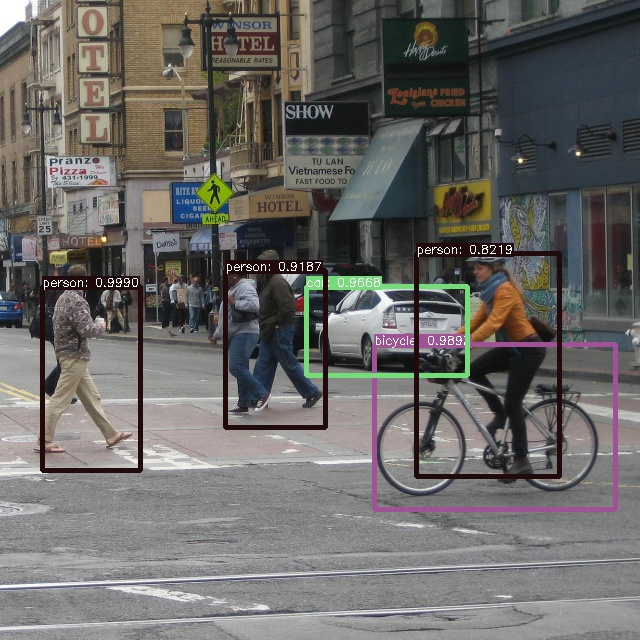

# SSD: Single Shot MultiBox Object Detector

This sample is what is ported from https://github.com/zhreshold/mxnet-ssd.cpp to C#.

**NOTE**<br>
This program is NOT identical to https://github.com/zhreshold/mxnet-ssd. Therefore, detect result may contain some difference.

## How to use?

## 1. Build mxnet

Basically, build step is identical to [Building and Installing Packages on Windows](https://mxnet.incubator.apache.org/versions/master/install/windows_setup.html#building-and-installing-packages-on-windows).
However, original MXNet does not support to use ssd. So [Joshua Z. Zhang](https://github.com/zhreshold) developed customized MXNet to use ssd.<br>
Please refer [mxnet-ssd](https://github.com/zhreshold/mxnet-ssd).

````
cd <SSD_dir>\mxnet
git submodule init
git submodule update
mkdir build
set OpenCV_DIR=D:/Works/Lib/OpenCV/3.2.0.prebuild/build
set OpenBLAS_HOME=D:/Works/Lib/OpenBLAS/0.2.19
cmake -G "Visual Studio 14 2015 Win64" ..
cmake --build . --config Release
````

After that, ***libmxnet.dll*** will be generated in build\Release

## 2. Build project

````
cd <SSD_dir>
dotnet build --configuration Release
````

At last, copy ***libmxnet.dll*** and dependencies to output directory; &lt;SSD_dir&gt;\bin\Release\netcoreapp2.0.

## 3. Download model file

Download pre-trained file form [here](https://github.com/zhreshold/mxnet-ssd.cpp/releases/download/v0.1/deploy_ssd_300_voc0712.zip).<gr>
This model files is provided by Joshua Z. Zhang. Thanks!!

````
cd <SSD_dir>
python -m pip install wget
python -m wget https://github.com/zhreshold/mxnet-ssd.cpp/releases/download/v0.1/deploy_ssd_300_voc0712.zip
python
>> import zipfile
>> zip = zipfile.ZipFile('deploy_ssd_300_voc0712.zip', 'r')
>> zip.extractall('model')
````

## 4. Run
````
cd <SSD_dir>
python -m wget https://github.com/zhreshold/mxnet-ssd.cpp/blob/master/demo/street.jpg
dotnet run --configuration Release --input=street.jpg --model=deploy_ssd_300 --epoch=1
````
The following image is result of above command. Test image is provided from Joshua Z. Zhang.


## 5. Others

### Use GPU

If you want to use GPU, change the following code, build and run!!
````
dotnet run --configuration Release --input=street.jpg --model=deploy_ssd_300 --epoch=1 --gpu=2
````

### Program does NOT exit!!

Please refer [C++ demo memory release problem](https://github.com/apache/incubator-mxnet/issues/7973)