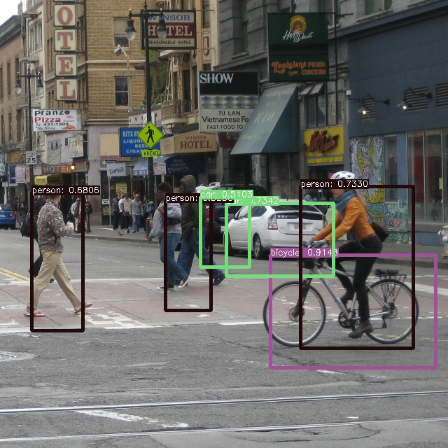

# YOLOv2: You Only Look Once

This sample is what is ported from https://github.com/zhreshold/mxnet-yolo to C#.

**NOTE**<br>
This program is NOT identical to https://github.com/zhreshold/mxnet-yolo. Therefore, detect result may contain some difference.

## How to use?

## 1. Build MXNet

Basically, build step is identical to [Building and Installing Packages on Windows](https://mxnet.incubator.apache.org/versions/master/install/windows_setup.html#building-and-installing-packages-on-windows).
However, original MXNet does not support to use YOLOv2. So [Joshua Z. Zhang](https://github.com/zhreshold) developed customized MXNet to use YOLOv2.<br>
Please refer [mxnet-yolo](https://github.com/zhreshold/mxnet-yolo).

At first, update submodules of MXNet. 

````
cd <YOLOv2_dir>\mxnet
git submodule update --init --recursive
````

Next, modified source code to build Visual Studio.
Open and Edit ***\<YOLOv2_dir>\mxnet\src\operator\contrib\yolo_output-inl.h*** by text editor.

```diff
-    .set_default({1.08, 1.19, 3.42, 4.41, 6.63, 11.38, 9.42, 5.11, 16.62, 10.52})
+    .set_default({1.08f, 1.19f, 3.42f, 4.41f, 6.63f, 11.38f, 9.42f, 5.11f, 16.62f, 10.52f})
```

At last, 

````
mkdir <YOLOv2_dir>\mxnet\build
cd <YOLOv2_dir>\mxnet\build
set OpenCV_DIR=D:/Works/Lib/OpenCV/3.2.0.prebuild/build
set OpenBLAS_HOME=D:/Works/Lib/OpenBLAS/0.2.19
cmake -G "Visual Studio 14 2015 Win64" ..
cmake --build . --config Release
````

After that, ***libmxnet.dll*** will be generated in build\Release

## 2. Build project

````
cd <YOLOv2_dir>
dotnet build --configuration Release
````

At last, copy ***libmxnet.dll*** and dependencies to output directory; &lt;YOLOv2_dir&gt;\bin\Release\netcoreapp2.0.

## 3. Download model file

Download pre-trained file form [here](https://github.com/zhreshold/mxnet-yolo/releases/download/0.1-alpha/yolo2_darknet19_416_pascalvoc0712_trainval.zip).<gr>
This model files is provided by Joshua Z. Zhang. Thanks!!

````
cd <YOLOv2_dir>
python -m pip install wget
python -m wget https://github.com/zhreshold/mxnet-yolo/releases/download/0.1-alpha/yolo2_darknet19_416_pascalvoc0712_trainval.zip
python
>> import zipfile
>> zip = zipfile.ZipFile('yolo2_darknet19_416_pascalvoc0712_trainval.zip', 'r')
>> zip.extractall()
````

## 4. Run
````
cd <YOLOv2_dir>
python -m wget https://github.com/zhreshold/mxnet-ssd.cpp/blob/master/demo/street.jpg
dotnet run --configuration Release --input=street.jpg --model=yolo2_darknet19_416 --epoch=0
````
The following image is result of above command. Test image is provided from Joshua Z. Zhang.


## 5. Others

### Use GPU

If you want to use GPU, change the following code, build and run!!
````
dotnet run --configuration Release --input=street.jpg --model=yolo2_darknet19_416 --epoch=0 --gpu=2
````

### Program does NOT exit!!

Please refer [C++ demo memory release problem](https://github.com/apache/incubator-mxnet/issues/7973)